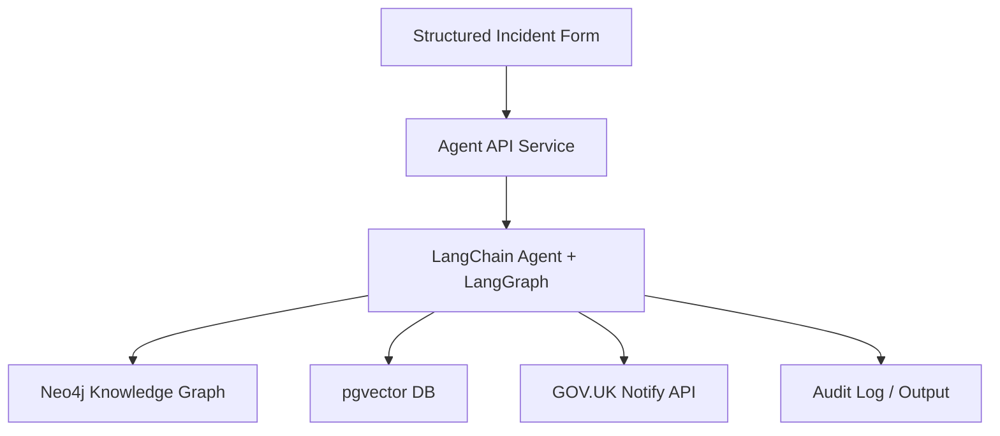

# Defra AI Agent Prototype for Environmental Incident Reporting

[](https://www.python.org/downloads/)
[](https://opensource.org/licenses/MIT)
[](https://github.com/psf/black)

> **A technical showcase demonstrating how AI agents, knowledge graphs, and semantic search can enhance environmental incident reporting workflows.**

## 🎯 Overview

This project demonstrates an end-to-end AI-powered system for processing environmental incident reports. It combines:

- **LangChain/LangGraph agents** for intelligent decision-making
- **Neo4j knowledge graph** for spatial and regulatory context
- **PostgreSQL + pgvector** for semantic document search
- **GOV.UK Notify** for automated notifications
- **FastAPI** for a modern, async API layer

The system accepts structured form submissions, classifies incidents, queries relevant context, and takes automated actions—all while maintaining full auditability.

## 🏗️ Architecture



### Technology Stack

| Component | Technology | Purpose |
|-----------|-----------|---------|
| **API Layer** | FastAPI | Async REST API for incident submission |
| **AI Orchestration** | LangChain + LangGraph | Agent reasoning and workflow control |
| **Knowledge Graph** | Neo4j 5.16 | Spatial relationships and protected sites |
| **Vector Search** | PostgreSQL + pgvector | Semantic search over guidance documents |
| **Notifications** | GOV.UK Notify | Email/SMS alerts to teams and citizens |
| **Embeddings** | OpenAI text-embedding-3-small | Document vectorization |
| **LLM** | OpenAI GPT-4 Turbo | Classification and reasoning |

## 📋 Prerequisites

- **Docker & Docker Compose** (recommended) or
- **Python 3.12+** for local development
- **uv** for fast package management (recommended)
- **OpenAI API key** (for embeddings and LLM)
- **GOV.UK Notify API key** (optional for notifications)

## 🚀 Quick Start

### 1. Clone the Repository

```bash
git clone https://github.com/steve-dickinson/agentic-incident-reporting.git
cd agentic-incident-reporting
```

### 2. Configure Environment

```bash
cp .env.example .env
# Edit .env and add your API keys
```

**Required environment variables:**
- `OPENAI_API_KEY`: Your OpenAI API key (required for embeddings and LLM)
- `NEO4J_PASSWORD`: Password for Neo4j database (choose a strong password)
- `POSTGRES_PASSWORD`: Password for PostgreSQL (choose a strong password)
- `NOTIFY_API_KEY`: GOV.UK Notify API key (optional for testing - can use test mode)
- `SECRET_KEY`: Random secret for security (generate with `openssl rand -hex 32`)

**Example .env setup:**
```bash
OPENAI_API_KEY=sk-your-key-here
NEO4J_PASSWORD=your_secure_password
POSTGRES_PASSWORD=another_secure_password
NOTIFY_API_KEY=your_notify_key-or-leave-empty-for-test-mode
SECRET_KEY=$(openssl rand -hex 32)
```

### 3. Start with Docker Compose

```bash
docker-compose up -d
```

This will start:
- **API service** on http://localhost:8000
- **Dashboard** on http://localhost:8502
- **Neo4j browser** on http://localhost:7475
- **PostgreSQL** with pgvector on port 5433

### 4. Verify Installation

```bash
# Check API health
curl http://localhost:8000/health

# View API documentation
open http://localhost:8000/docs

# Access Streamlit dashboard
open http://localhost:8502
```

## 💻 Local Development Setup

If you prefer to run without Docker:

```bash
# Create virtual environment with uv (recommended - much faster!)
uv venv --python 3.12
source .venv/bin/activate  # On Windows: .venv\Scripts\activate

# Install dependencies
uv pip install -e ".[dev,docs]"

# Generate synthetic test data
python -m app.tools.synthetic_data

# Start PostgreSQL and Neo4j separately, then run the API
uvicorn app.api.main:app --reload --host 0.0.0.0 --port 8000
```

### Alternative: Traditional pip/venv
```bash
python3.12 -m venv venv
source venv/bin/activate
pip install -r requirements.txt
```

## ✨ Key Features

- **🤖 Intelligent Classification** - AI-powered incident categorization with P1-P4 priority assignment
- **🗺️ Spatial Awareness** - Integration with Neo4j to identify nearby protected sites and water bodies
- **📚 Semantic Search** - pgvector-powered search over guidance documents and regulations
- **🔔 Automated Notifications** - GOV.UK Notify integration for email/SMS alerts
- **📊 Real-time Dashboard** - Streamlit dashboard with metrics, charts, and execution logs
- **🔍 Full Auditability** - Comprehensive logging of all agent decisions and actions
- **🧪 Well-Tested** - 72 tests with 57% coverage across unit and integration tests
- **📖 Documented** - Complete API docs, guides, and example scenarios

## 📊 Dashboard

Access the Streamlit dashboard at http://localhost:8502 to monitor:

- **Real-time metrics**: Total incidents, priorities (P1-P4), completion rates
- **Processing times**: Average time per incident and hourly trends
- **Priority distribution**: Visual breakdown of incident priorities
- **Recent incidents**: Searchable table with filtering
- **Execution logs**: Step-by-step agent execution details with timing
- **Charts**: Hourly incident trends, processing time graphs, status overview

The dashboard provides full visibility into agent execution for debugging and monitoring.

## 🧪 Testing

```bash
# Activate virtual environment first
source .venv/bin/activate

# Run all tests
pytest

# Run with coverage
pytest --cov=app --cov-report=html --cov-report=term-missing

# Run specific test suite
pytest tests/unit/ -v
pytest tests/integration/ -v

# Run specific test file
pytest tests/unit/test_classification.py -v

# Generate test data
python -m app.tools.synthetic_data
```

**Test Coverage:**
- **72 tests** passing (34 unit, 38 integration)
- **57% overall coverage**
- Classification tool: 99% coverage
- API endpoints: 94% coverage
- Agent workflow: 91% coverage
- Notification tool: 90% coverage

## 📚 Documentation

- **[Getting Started Guide](docs/guides/getting_started.md)** - Complete setup walkthrough
- **[System Architecture](docs/architecture/system_design.md)** - Technical deep dive
- **[Dashboard Guide](docs/dashboard-guide.md)** - Real-time monitoring and analytics
- **[Demo Walkthrough](docs/examples/demo_walkthrough.md)** - Example scenarios and testing
- **[API Reference](http://localhost:8000/docs)** - Interactive Swagger UI docs
- **[GitHub Pages](https://steve-dickinson.github.io/agentic-incident-reporting/)** - Full documentation site

### Build Documentation Locally

```bash
# Install docs dependencies
uv pip install -e ".[docs]"

# Serve documentation locally
mkdocs serve

# Open http://localhost:8001 in browser

# Build static site
mkdocs build
```

## 🔧 Development Workflow

1. **Create feature branch**: `git checkout -b feature/your-feature`
2. **Activate environment**: `source .venv/bin/activate`
3. **Make changes** with tests
4. **Format code**: `black app/ tests/`
5. **Check linting**: `flake8 app/ tests/`
6. **Type check**: `mypy app/`
7. **Run tests**: `pytest --cov=app`
8. **Commit and push**: Follow [conventional commits](https://www.conventionalcommits.org/)
9. **Create pull request**

### Code Quality Tools

```bash
# Format code
black app/ tests/

# Lint
flake8 app/ --max-line-length=100

# Type checking
mypy app/ --ignore-missing-imports

# Run all quality checks
black app/ tests/ && flake8 app/ && mypy app/ && pytest
```

## 🎬 Demo Walkthrough

Run the complete demo to see all features in action:

```bash
# Make sure services are running
docker compose up -d

# Wait for services to be ready
sleep 10

# Run the demo script
./demo_test.sh
```

The demo script tests 5 scenarios:
1. **Critical water pollution** - P1 priority, drinking water keywords
2. **Oil spill near SSSI** - Spatial awareness demonstration
3. **Illegal dumping** - Waste-specific action generation
4. **Low-priority noise** - Routine response workflow
5. **Air pollution without coordinates** - Graceful handling

See [`docs/examples/demo_walkthrough.md`](docs/examples/demo_walkthrough.md) for detailed walkthrough with expected responses.

## 📖 API Usage Example

```python
import requests

incident = {
    "incident_type": "water_pollution",
    "location": "River Thames near Reading",
    "latitude": 51.4543,
    "longitude": -0.9781,
    "description": "Oil spill observed in river",
    "reporter_email": "citizen@example.com",
    "urgency": "high"
}

response = requests.post(
    "http://localhost:8000/api/v1/incidents/submit",
    json=incident
)

print(response.json())
```

## 📝 License

This project is licensed under the MIT License - see the LICENSE file for details.

**⚠️ Note**: This is a prototype system using synthetic data. Do not use for production incident reporting without proper security, privacy, and compliance reviews.