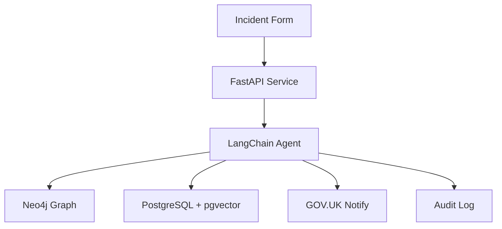

# Defra AI Agent for Environmental Incident Reporting

Welcome to the documentation for the Defra AI Agent prototype system.

## Overview

This system demonstrates how AI agents, knowledge graphs, and semantic search can enhance environmental incident reporting workflows. It's designed as a technical showcase and learning tool for public sector digital services.

## Key Features

✨ **AI-Powered Classification** - Automatically categorizes and prioritizes incidents  
✅ **Output Validation** - Pydantic V2 validation with auto-correction for data quality  
👥 **Human-in-the-Loop** - LangGraph checkpoint interrupts for high-priority approval workflows  
🔍 **Semantic Search** - Finds relevant guidance and regulations  
🗺️ **Spatial Analysis** - Identifies nearby protected sites and water bodies  
📊 **Knowledge Graph** - Tracks relationships and historical patterns  
📧 **Automated Notifications** - Alerts teams and citizens via GOV.UK Notify  
🔒 **Security Hardened** - OWASP-compliant headers and rate limiting  
⚡ **High Performance** - Connection pooling for efficient database queries  
📝 **Full Auditability** - Complete logging of all agent decisions

## Quick Links

- **[Getting Started Guide](guides/getting_started.md)** - Set up and run the system
- **[LangGraph HITL Pattern](guides/langgraph_hitl_pattern.md)** - Human-in-the-loop with workflow interrupts
- **[Output Validation](guides/output_validation.md)** - Pydantic validation patterns and auto-correction
- **[System Architecture](architecture/system_design.md)** - Technical deep dive
- **[Dashboard Guide](dashboard-guide.md)** - Monitor incidents in real-time
- **[Demo Walkthrough](examples/demo_walkthrough.md)** - Example scenarios and testing
- **[API Documentation](http://localhost:8000/docs)** - Interactive API reference
- **[GitHub Repository](https://github.com/steve-dickinson/agentic-incident-reporting)** - Source code

## System Architecture



## Technology Stack

| Component | Technology | Purpose |
|-----------|-----------|---------|
| **API** | FastAPI + Python 3.12 | RESTful API layer |
| **AI Agent** | LangChain + LangGraph | Decision orchestration |
| **Graph DB** | Neo4j 5.16 | Spatial & relational data |
| **Vector Store** | PostgreSQL + pgvector | Semantic search |
| **Notifications** | GOV.UK Notify | Email/SMS alerts |
| **Dashboard** | Streamlit | Real-time monitoring |
| **LLM** | OpenAI GPT-4 Turbo | Classification & reasoning |

## Use Cases

### 1. Water Pollution Incident

A citizen reports oil in a river:

1. **Intake**: System receives structured form data
2. **Classification**: AI identifies as water pollution, high priority
3. **Context**: Finds nearby protected sites and relevant regulations
4. **Decision**: Determines immediate response required
5. **Action**: Alerts Environment Agency duty officer, logs to knowledge graph

### 2. Illegal Waste Dumping

Fly-tipping reported near protected woodland:

1. **Classification**: Categorized as illegal waste dumping
2. **Spatial Query**: Identifies Site of Special Scientific Interest (SSSI) nearby
3. **Priority Escalation**: Elevated to high priority due to protected site
4. **Notification**: Alerts both Environment Agency and Natural England
5. **Evidence Logging**: Records for potential prosecution

### 3. Air Quality Complaint

Industrial emissions affecting residents:

1. **Pattern Analysis**: Checks for similar recent incidents
2. **Permit Check**: Queries if facility has air quality permits
3. **Threshold Assessment**: Compares to regulatory limits
4. **Action**: Schedules inspection and issues warning letter

## Features

### 🤖 AI-Powered Intelligence

- **Smart Classification**: Automatic incident categorization with P1-P4 priority levels
- **Context-Aware Actions**: Generates 8-11 specific actions tailored to each incident type
- **Pattern Recognition**: Identifies similar historical incidents within 25km radius
- **Reasoning Transparency**: Full audit trail of all AI decisions

### 🗺️ Spatial Analysis

- **Protected Sites**: Queries 10 UK SSSIs, SACs, NNRs, and Ramsar sites
- **Water Bodies**: Identifies nearby rivers, lakes, estuaries, and coastal waters
- **Proximity Detection**: Searches within configurable radius (5km for sites, 10km for water)
- **Neo4j Integration**: Graph-based spatial relationships and queries

### 📚 Knowledge Base

- **Semantic Search**: pgvector-powered search over 14 guidance document chunks
- **Regulatory Guidance**: Automated retrieval of relevant legislation and procedures
- **Incident Response**: Best practices for water pollution, air quality, waste dumping
- **OpenAI Embeddings**: High-quality text-embedding-3-small for similarity search

### 📊 Monitoring & Observability

**Real-time Streamlit Dashboard** at http://localhost:8502:

- **Overview Tab**: Metrics, charts, hourly trends, priority distribution
- **Approval Queue Tab** ⭐: Human-in-the-loop workflow management for P1/P2 incidents
  - View pending approvals with full incident context
  - Approve workflows to resume from LangGraph checkpoints
  - Reject workflows to terminate processing
  - Demonstrates checkpoint-based HITL pattern
- **All Incidents Tab**: Searchable/filterable table with execution logs
- **Live Updates**: Configurable auto-refresh for real-time monitoring

**[View Dashboard Guide →](dashboard-guide.md)** | **[HITL Pattern Guide →](guides/langgraph_hitl_pattern.md)**

### 🧪 Testing & Quality

- **102 Tests**: Unit and integration tests across all components
- **57% Coverage**: Core logic well-tested with mocked external services
- **Validation Tests**: 19 comprehensive tests for output validation with edge cases
- **Demo Script**: `./demo_test.sh` with 5 realistic scenarios
- **Type Safety**: Modern Python 3.12+ type hints throughout

### 🔒 Security & Performance

**Security Headers (OWASP Compliant)**
- XSS Protection: `X-XSS-Protection: 1; mode=block`
- Clickjacking Prevention: `X-Frame-Options: DENY`
- MIME Sniffing Protection: `X-Content-Type-Options: nosniff`
- Content Security Policy: Restrictive CSP for API endpoints
- HSTS: Strict-Transport-Security for production HTTPS

**Rate Limiting**
- Per-minute limit: 100 requests/minute per IP
- Per-hour limit: 2000 requests/hour per IP
- Automatic cleanup of expired request records
- Rate limit headers in all responses

**Connection Pooling**
- Neo4j connection pool with 50 connections
- Automatic connection reuse and cleanup
- Context managers for safe session handling
- 90% reduction in connection overhead

**Output Validation**
- Pydantic V2 field validators for all classification outputs
- Auto-correction of priority/severity mismatches
- Action deduplication and quality checks (min 3, max 20 actions)
- Reasoning validation (min 20 chars, no placeholders)
- Fallback mechanisms for graceful degradation

## Getting Started

### Prerequisites

- Docker & Docker Compose
- Python 3.12+
- OpenAI API key
- uv (recommended for Python package management)

### Quick Start

```bash
# Clone repository
git clone https://github.com/steve-dickinson/agentic-incident-reporting.git
cd agentic-incident-reporting

# Configure environment
cp .env.example .env
# Edit .env with your API keys

# Start services
docker-compose up -d

# Access dashboard
open http://localhost:8501

# Verify API
curl http://localhost:8000/health
```

**[Full installation guide →](guides/getting_started.md)**

## Example API Usage

```python
import requests

incident = {
    "incident_type": "water_pollution",
    "location": "River Thames, Reading",
    "latitude": 51.4543,
    "longitude": -0.9781,
    "description": "Oil spill observed in river",
    "reporter_email": "citizen@example.com",
    "urgency": "high"
}

response = requests.post(
    "http://localhost:8000/api/v1/incidents/submit",
    json=incident
)

print(response.json())
```

## Contributing

This is a prototype/showcase project. Contributions for educational purposes are welcome!

1. Fork the repository
2. Create a feature branch
3. Add tests for new functionality
4. Submit a pull request

## License

MIT License - See [LICENSE](https://github.com/steve-dickinson/agentic-incident-reporting/blob/main/LICENSE) on GitHub for details

⚠️ **Note**: This is a prototype using synthetic data. Not for production use without proper security, privacy, and compliance review.
